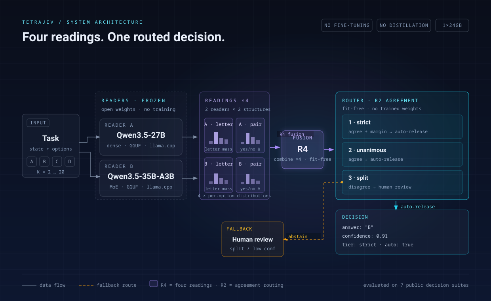
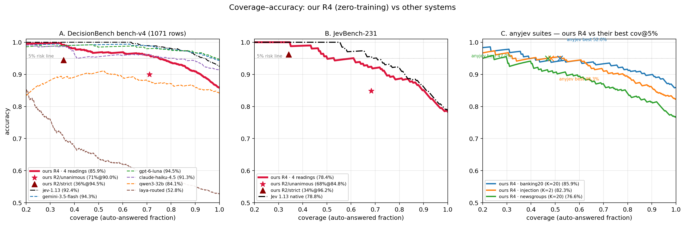

# TetraJev

**Four readings. One routed decision.** Two frozen open-weight models, four independent readings per task, one fit-free decision layer — Jev-class decision behaviour with **no fine-tuning and no distillation**.



<sub>Vector source: [`assets/tetrajev-architecture.svg`](assets/tetrajev-architecture.svg). Each frozen reader reads a task twice: a **letter readout** (probability mass over the option letters) and a **pair readout** (per-candidate yes/no Δ). The four per-option distributions are combined fit-free (**R4**) and routed by agreement (**R2**: strict / unanimous / split). Split or low-confidence items abstain to human review.</sub>

TetraJev turns off-the-shelf open-weight models — [Qwen3.5-27B](https://huggingface.co/Qwen/Qwen3.5-27B) (dense) and [Qwen3.5-35B-A3B](https://huggingface.co/Qwen/Qwen3.5-35B-A3B) (MoE), served as GGUF via llama.cpp on a single 24 GB GPU — into a calibrated decision layer for **bounded decision tasks**: a state plus a finite option set (K = 2…20). Classification, routing, yes/no gates, entity matching, reranking and multiple-choice judgment all reduce to the same primitive *(state + options) → probability distribution*, and that is all TetraJev needs to run.

## Why four readings?

Two readers × two readout structures. A single reading is one opinion; four readings give the router something a single reading cannot provide: **agreement**. R4 (fusion) raises full-coverage accuracy; R2 (agreement routing) sorts items into *strict*, *unanimous* and *split*, so a deployment can auto-release only the items both readers and both structures see the same way — and abstain on the rest. Everything is fit-free: no trained weights, no constants calibrated on the evaluation data; readings are deterministic greedy decodes.

## Results so far

Headline numbers on public decision suites (initial release; tables, coverage curves and caveats in [`docs/results.md`](docs/results.md)):

| Suite | items | R4 accuracy (full coverage) | coverage @ ≥95% precision | reference |
|---|---:|---:|---:|---|
| DecisionBench bench-v4 | 1,070 | **85.9%** | **75.0%** | Jev 1.13: 92.4% |
| JevBench-231 | 231 | **78.4%** | 61.0% | Jev 1.13 (same items): 78.8% |
| banking20 | 298 | **85.9%** | 41.6% | best published open repro: 80.7% |
| newsgroups | 299 | **76.6%** | 29.8% | best published open repro: 73.7% |
| injection | 300 | **82.3%** | 53.7% | best published open repro: 86.0% |
| typed-decisions | 2,000 | **71.8%** | 16.1% | Jev 1.13: 72.7% |
| OpenSanctions (27B pass) | 9,800 | F1 **98.58** (letter) · 97.85 (pair) | — | Jev 1.13: 98.87 |



<sub>Coverage–accuracy curves. Left: DecisionBench vs official models. Middle: JevBench vs Jev. Right: three classification suites vs the best published cov@5% points of the open-reproduction family. Higher-left is better; the dotted line marks the 5% risk level (≥95% precision).</sub>

## Design invariants

- **No training of any kind** — weights are frozen; nothing is fitted, distilled or fine-tuned on evaluation data.
- **Fit-free fusion** — R4 combines readings with fixed equal weights; R2 thresholds are rule-based, not fitted.
- **Deterministic readings** — greedy decode, one-token continuation, log-probability readout. Verified bit-identical across serving configurations (8k vs 16k context, 9,486 shared items, max probability delta 0.00e+00).
- **Model-agnostic** — any local server exposing token logprobs works; the shipped results pin the two Qwen3.5 readers above.
- **Local & private by construction** — one 24 GB GPU; no data leaves the machine.

## Repository layout

```
scripts/   per-suite runners + fusion/coverage/figure tools (reproduce every number in docs/results.md)
docs/      method.md (readings, R4/R2, serving) · results.md (all published numbers + caveats)
assets/    architecture diagram · coverage figures
```

## Status & roadmap

Initial release: scripts + aggregate results for seven public suites. **In progress:** spam-eval (5,733 messages), Jev RAG reranking (SciFact 300 / XQuAD-en 1,190 queries), and the second-reader pass for OpenSanctions — results will be updated in place. Roadmap: quality-weighted fusion (after the fit-free baseline), release-gate calibration reports, additional suites.

## Reproducing

- Serve the two frozen readers (GGUF, llama.cpp, `-np 1` so each request gets the full context); runners are standard-library only and speak to a local OpenAI-compatible server (`--server`).
- `scripts/README.md` maps each suite to its runner; `requirements.txt` covers the plotting tools (figures only).
- Benchmarks are fetched from their original sources by the scripts; **nothing from those corpora is redistributed here** — see [`DATA_POLICY.md`](DATA_POLICY.md).

## License & provenance

- MIT — see [`LICENSE`](LICENSE).
- Development assisted by AI tooling; every number above is reproducible from the shipped scripts against the per-suite result files.
- TetraJev is an independent research project, not affiliated with TypeSafe AI. "Jev" in the name refers to the decision-benchmark lineage the wider community compares against.
